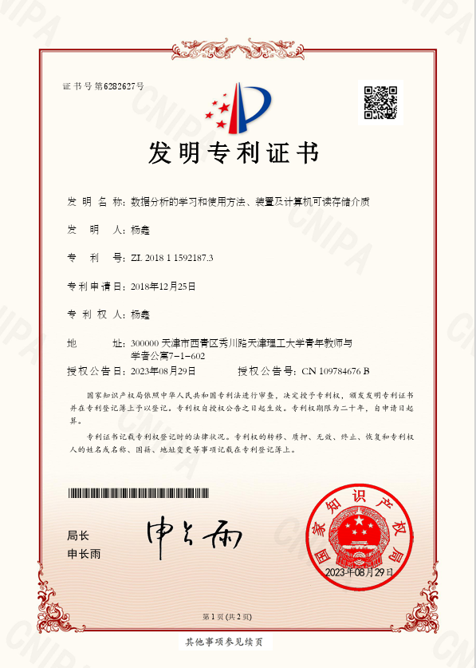
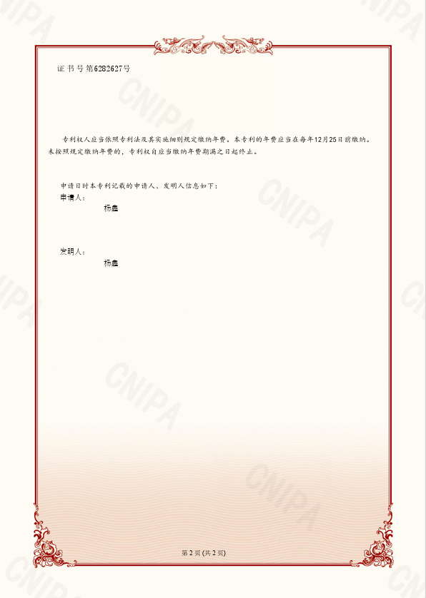
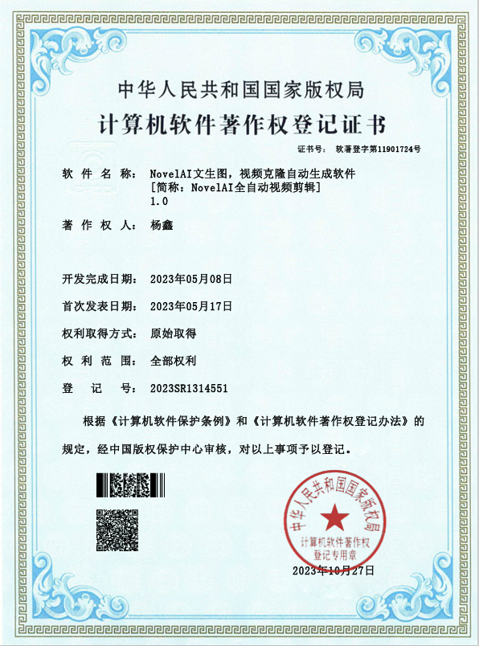

# Learning-Notes-and-Projects
 主要内容是我的各种学习笔记和应用案例。

欢迎来到这一全方位的Python技术探索之旅！无论你是初学者，还是资深开发者，这里都有你想要的。从[Python学习杂谈](./articles_by_column/01.Python 学习杂谈.md)开始，我们将带你了解Python的软件环境，编程基础，数据处理，网络爬虫技术，直至Web开发、数据分析、可视化、视频剪辑、AI技术、自然语言处理、音频技术、计算机视觉等前沿领域。

不仅如此，我们还为你准备了实用程序、数据分析案例，以及最新的Stable Diffusion AI绘画技术。每一篇内容都是精心准备，旨在为你提供最实用、最深入的技术解读。

点击上方的链接，开启你的Python学习之旅，探索无穷的技术魅力！

| 编号 | 专栏名称 | 阅读链接 |
| ---- | -------- | -------- |
| 01 | Python 学习杂谈 | [查看](./articles_by_column/01.Python%20%E5%AD%A6%E4%B9%A0%E6%9D%82%E8%B0%88.md) |
| 02 | Python 全栈开发 | [查看](./articles_by_column/02.Python%20%E5%85%A8%E6%A0%88%E5%BC%80%E5%8F%91.md) |
| 03 | Python 编程基础 | [查看](./articles_by_column/03.Python%20%E7%BC%96%E7%A8%8B%E5%9F%BA%E7%A1%80.md) |
| 04 | AIGC 企业应用 | [查看](./articles_by_column/04.AIGC%20%E4%BC%81%E4%B8%9A%E5%BA%94%E7%94%A8.md) |
| 05 | Python 网络爬虫 | [查看](./articles_by_column/05.Python%20%E7%BD%91%E7%BB%9C%E7%88%AC%E8%99%AB.md) |
| 06 | Python Web开发 | [查看](./articles_by_column/06.Python%20Web%E5%BC%80%E5%8F%91.md) |
| 07 | Python 数据分析师 | [查看](./articles_by_column/07.Python%20%E6%95%B0%E6%8D%AE%E5%88%86%E6%9E%90%E5%B8%88.md) |
| 08 | Python 数据可视化 | [查看](./articles_by_column/08.Python%20%E6%95%B0%E6%8D%AE%E5%8F%AF%E8%A7%86%E5%8C%96.md) |
| 09 | Python 视频剪辑 | [查看](./articles_by_column/09.Python%20%E8%A7%86%E9%A2%91%E5%89%AA%E8%BE%91.md) |
| 10 | MySQl 数据仓库 | [查看](./articles_by_column/10.MySQl%20%E6%95%B0%E6%8D%AE%E4%BB%93%E5%BA%93.md) |
| 11 | Python 实用程序 | [查看](./articles_by_column/11.Python%20%E5%AE%9E%E7%94%A8%E7%A8%8B%E5%BA%8F.md) |
| 12 | Python AI数字人 | [查看](./articles_by_column/12.Python%20AI%E6%95%B0%E5%AD%97%E4%BA%BA.md) |
| 13 | Python 自然语言技术 | [查看](./articles_by_column/13.Python%20%E8%87%AA%E7%84%B6%E8%AF%AD%E8%A8%80%E6%8A%80%E6%9C%AF.md) |
| 14 | Python 音频技术 | [查看](./articles_by_column/14.Python%20%E9%9F%B3%E9%A2%91%E6%8A%80%E6%9C%AF.md) |
| 15 | Python 计算机视觉 | [查看](./articles_by_column/15.Python%20%E8%AE%A1%E7%AE%97%E6%9C%BA%E8%A7%86%E8%A7%89.md) |
| 16 | Python 深度学习 | [查看](./articles_by_column/16.Python%20%E6%B7%B1%E5%BA%A6%E5%AD%A6%E4%B9%A0.md) |
| 17 | Python 机器学习 | [查看](./articles_by_column/17.Python%20%E6%9C%BA%E5%99%A8%E5%AD%A6%E4%B9%A0.md) |
| 18 | Stable Diffusion AI绘画 | [查看](./articles_by_column/18.Stable%20Diffusion%20AI%E7%BB%98%E7%94%BB.md) |
| 19 | AIGC工具箱 | [查看](./articles_by_column/19.AIGC%E5%B7%A5%E5%85%B7%E7%AE%B1.md) |

我的一些工作成绩

**发明专利**

**软件著作**

欢迎加入QQ组织学习和讨论，如果觉得我的内容对你有帮助的话欢迎打赏，感谢支持！！！

